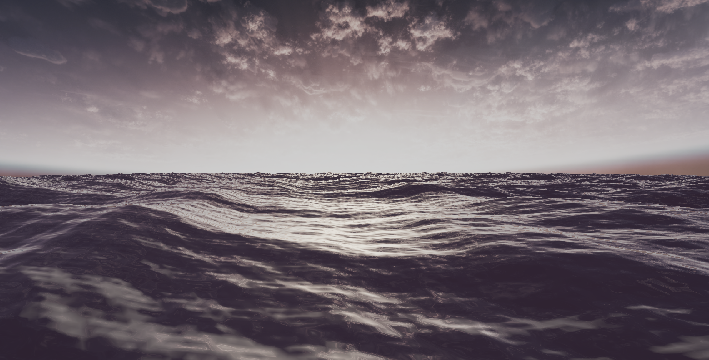

# Ocean Waves Shader

A lightweight ocean rendering project featuring **procedural wave displacement** and **realistic water shading** based on a sum-of-sines wave model.

This project uses a custom vertex/fragment shader to simulate animated ocean waves in Unity without relying on complex simulation techniques or external assets.

---

## Features

- **Vertex displacement** based on multiple sine waves
- **Procedural normals** from analytical wave gradients
- **Physically-inspired shading** with:
  - Fresnel reflection
  - Skybox reflection
  - Diffuse and specular lighting
  - Depth-based color blending (shallow and deep)
  - Simple slope-based foam (doesn't work well at the moment)
- **Fully GPU-driven**: no textures, no baked data
- **Custom mesh generation** at runtime

---

## Parameters

### Shader (`Shader "Unlit/OceanWater"`)
- `_SunColor` - directional light color
- `_SpecularColor`, `_SpecularPower` - controls highlight intensity
- `_FresnelPower` - sharpness of view-angle-based reflection
- `_ShallowColor`, `_DeepColor` - water base color by depth
- `_DepthFadeDistance` - controls transition range between deep and shallow water
- `_SkyboxTex` - cubemap used for reflection
- `_FoamSharpness`, `_FoamIntensity` - controls appearance of crest foam

### C# Controller (`OceanWaves.cs`)
- `numWaves` - number of sine waves combined
- `randomSeed` - deterministic wave generation
- `speedFactor`, `baseWaveAmplitude`, `baseWaveLength` - global wave properties
- `edgeLength`, `edgeResolution` - mesh density and extent

---

## Example Scene

---